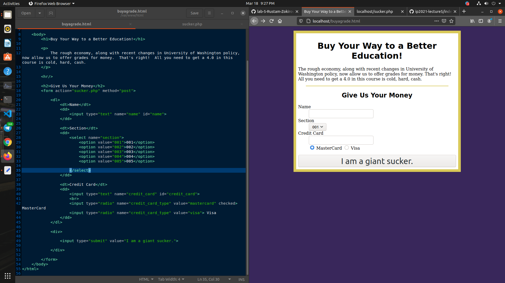
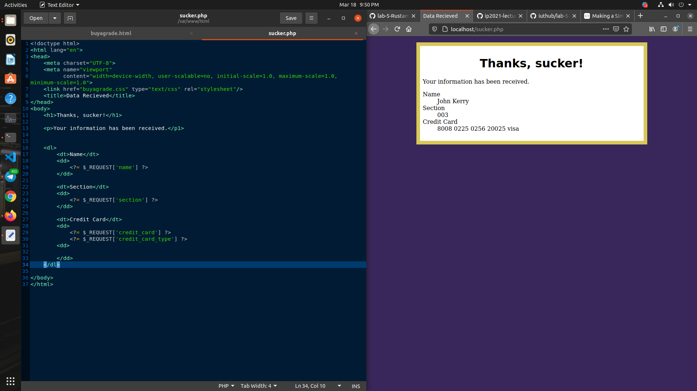
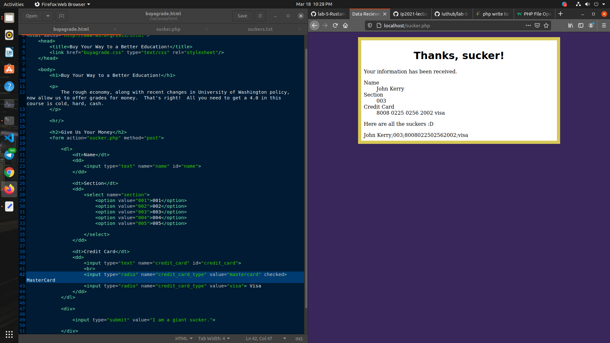

# Lab 5: Buy Grades For Money

In this exercises, you should make a form which takes payment information from suckers who want to buy a grade, and store it in a `suckers.txt` file.

### Student Details:

- **Student ID**: U1910049
- **Student Name**: Rustam Zokirov
- **Section Number**: 002

### Screenshots:
1. Creating a form:
 
2. Displaying input data:
 
3. Save the form data:
 

